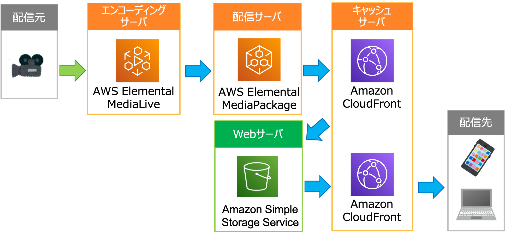

# Live Streaming on AWS with MediaPacakge

動画ストリーミング配信(HLS)をブラウザ視聴するためのソリューション

## アジェンダ
- [課題と目的](#purpose)
- [構成図](#architecture-overview)
- [構築手順](#howto)
- [著者](#author)

## 課題と目的

### 課題
動画ストリーミング配信プロトコルとしてApple社が開発したHTTP Live Sreaming(以下、HLS)がよく知られている。
これはHTTPプロトコルをベースとしたプロトコルであり、様々な機器において受信(保存)することができる。
ただ視聴には、対応したWebブラウザが必要であり、デフォルトでHLSを視聴できるものはSafariのみであり、視聴を行うためには2つの方法がある。
* 各クライアント端末内のWebブラウザでHLSが視聴できるように拡張機能をインストールする(Safariはデフォルト)
* Webサーバを構築し、視聴を行うためのスクリプト(js)をWebサーバからクライアント端末に配布することで視聴を行う。

### 目的
本ソリューションにおいては、事前インストールの必要ないWebサーバを構築する方法を行う。

WebサーバとしてはAmazon Simple Storage Service (以下S3)を使用する。
またS3へのアクセスはCloudFrontを用いることで、セキュリティと通信速度を向上させる。

## 構成図

## 構築手順

### 0. 事前準備
* MediaLive, MediaPackage, CloudFrontが利用可能な状態であること。
* MediaPackageにおいて、HLS用のエンドポイントが作成されていること。

### 1. S3
[次のURL](https://github.com/rinakia/LiveStreamingOnAWS) においてソースをダウンロードする。

「DemoS3bucket」-「assets」フォルダ内の「aws-exports.js」を以下のように修正する。
* hls_manifest: [MediaPackageをオリジンとしているCloudFrontのURL]

S3を新規作成し、「DemoS3bucket」フォルダ内のファイル/フォルダを全てS3にアップロードする。
 > Webコンソール画面にて実施する場合、複数回に分けてアップロードする必要がある...

### 2. CloudFront
CloudFrontを新規作成し、オリジンとして作成したS3を選択する。
設定概要は以下
* Origin Domain Name: [作成したS3]
* Restrict Bucket Access: Yes
* Grant Read Permissions on Bucket: Yes, Update Bucket Policy

### 3. Webブラウザ
作成したCloudFrontの状態が[Enable]であることを確認し、以下のURLにアクセスする。

http://[作成したCloudFrontのドメイン名]/index.html

動画配信が行われている際に、「PreviewHLS」ボタンを選択すると視聴が開始されることを確認する。

## 著者

(C) 2021 A.Tada

